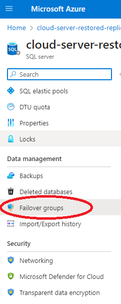
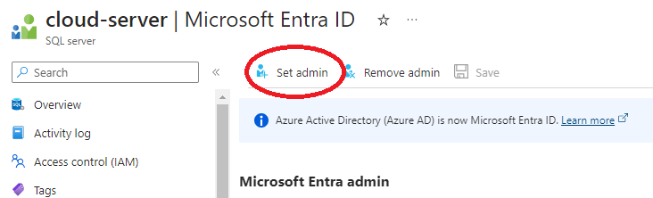
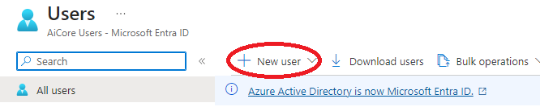
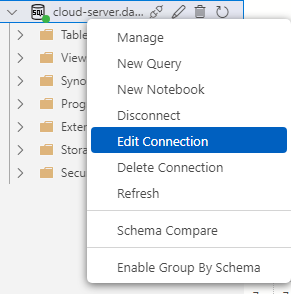
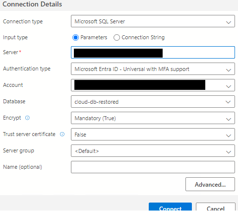

# Multinational Retail Data Centralisation

## Table of Content

- [Description](#description)
- [Setting up the production environment](#setting-up-the-production-environment)
- [Migrating to the Azure SQL Database](#migrating-to-the-azure-sql-database)
- [Data Backup and Restoration](#data-backup-and-restoration)
- [Disaster Recovery](#disaster-recovery)
- [Geo Replication and Failover](#geo-replication-and-failover)
- [Microsoft Entra Directory Integration](#microsoft-entra-directory-integration)

## Description

In this project, my task is to design and deploy a cloud-based database system on Microsoft Azure, demonstrating my proficiency in cloud engineering. Initially, I'll establish a production environment database and subsequently migrate it to Azure SQL Database, focusing on essential aspects like data backup, restoration, and automated scheduling to bolster data management.

Next, I'll simulate a disaster recovery scenario to test resilience, exploring geo-replication and failover configuration complexities to ensure data availability under adverse conditions. Additionally, I'll enhance security by integrating Microsoft Entra ID, defining access roles for an added layer of control and protection.

## Setting up the production environment

I established the foundation for my cloud-based database system on Azure. Firstly, I provisioned a Windows Virtual Machine, serving as the cornerstone of my production environment.

Following that, I installed SQL Server and SQL Server Management Studio, equipping my environment with the necessary tools for efficient database management and interaction.

Set up Azure Virtual Machine

[Download SQL Server](https://go.microsoft.com/fwlink/p/?linkid=2215158&clcid=0x809&culture=en-gb&country=gb)

[Download SQL Server Management Studio (SSMS)](https://aka.ms/ssmsfullsetup)

Create a production database by restoring from the [AdventureWorks]('https://aicore-portal-public-prod-307050600709.s3.eu-west-1.amazonaws.com/project-files/93dd5a0c-212d-48eb-ad51-df521a9b4e9c/AdventureWorks2022.bak') database.

## Migrating to the Azure SQL Database

In this milestone, I focused on transitioning my database to Azure's cloud ecosystem by migrating the on-premise database to an Azure SQL Database.

I orchestrated the process, ensuring that both the schema and data were successfully transferred, while leveraging the capabilities of Azure Data Studio for a streamlined migration experience.

Set up Azure SQL Database

Connect to it using SSMS

Extensions<br>


Install the SQL Server Schema Compare extension <br> and use it to compare the schema of the on-premise DB with the schema of the cloud DB. Then migrate the local schema to the cloud DB.

Install the Azure SQL Migration extension<br> and use it to migrate local DB to the cloud DB.

No carry out a comprehensive check on the cloud DB and ensure nothing was lost in the migration process.

## Data Backup and Restoration

In this milestone, my focus was on ensuring the secure storage of data in my production database on Azure, followed by creating a development environment for the database.

By provisioning a development database, one can test and experiment without concerns about impacting the main production data. This separation is vital for implementing changes and enhancements while preserving the integrity of live data.

Lastly, I established an automated backup solution for the development environment. This solution not only safeguards ongoing work but also assists developers in efficiently testing changes and facilitates quick recovery from errors or data loss.

Create a local backup


Create a blob storage account on Azure

Upload the created backup file to the blob storage container

Set up Azure Virtual Machine<br> to serve as the development environment.

Using the backup stored in the blob storage container, restore it into the development virtual environment.

Set up a weekly backup schedule:

First make sure the SQL Server Agent is started<br>

Create your SQL Server Credential by running the following

```sql
CREATE CREDENTIAL [YourCredentialName]
WITH IDENTITY = '[Your Azure Storage Account Name]',
SECRET = 'Access Key';
```

Start the Maintenance plan wizard


You can use the maintenance plan wizard to set up a weekly backup to a local folder or preferably to your blob storage container on Azure.

## Disaster Recovery

I conducted a disaster recovery simulation. By intentionally simulating data loss in my production environment, I gained firsthand experience in recovery procedures.

1. Selected the top 100 of the the Addresses table
   

2. Changed the PostalCode column to 1

   ```sql
   UPDATE top(100) [Person].[Address]
   SET [PostalCode] = 1

   ```

3. Selected the top 100 of the the Addresses table again to make the change took place
   

4. Use Azure SQL Database Backup to restore the production database
   

5. Verify the restoration process was successful by connecting to restored DB on Azure Data Studio and querying the same table again
   

## Geo Replication and Failover

I configured geo-replication for my production database to enhance data protection by establishing a synchronized copy of my production Azure SQL Database in a secondary region. This strategic redundancy ensures continuous data availability and minimizes potential downtime during unforeseen disruptions.

Additionally, I oversaw failover tests aimed at simulating real-world scenarios. A planned failover to the secondary region allowed me to assess the availability and consistency of the secondary database. This process provided valuable insights into the failover mechanism and its impact on my data ecosystem.

Go to the production DB and set up a replica in a different region, preferably far from your primary DBs location.


Orchestrate a planned failover to the secondary region and a failback to the primary to test the functionality and be prepared if it's ever needed.<br>


## Microsoft Entra Directory Integration

I integrated Microsoft Entra Directory with my Azure SQL Database setup, introducing a more organized way to manage who can access my data.

I began by creating an admin account that holds the authority to manage and oversee my production database. Additionally, I provisioned database reader users, accounts that possess read-only access to the database. By offering restricted access, I ensure that team members can derive the necessary insights without the risk of unintended data modifications.

Enable Microsoft Entra ID authentication for the SQL Server that hosts the Azure SQL production database and set up an admin


Create a user and assign the db_datareader role


Reconnect to the DB and ensure the new user has read only access




## What I learned

- Provisioning a Windows Virtual Machine as the foundation of my cloud-based database system.
- Migrating an on-premise database to Azure SQL Database, ensuring successful transfer of schema and data.
- Establishing a development environment alongside the production database for testing and experimentation.
- Implementing an automated backup solution for the development environment to safeguard ongoing work.
- Conducting a disaster recovery simulation to gain firsthand experience in recovery procedures.
- Configuring geo-replication for enhanced data protection and continuous availability.
- Overseeing failover tests to simulate real-world scenarios and assess secondary database availability.
- Integrating Microsoft Entra Directory with Azure SQL Database for organized access management.
- Creating admin and database reader user accounts to manage and restrict access to the database.
- Understanding the importance of data security, redundancy, and access control in a cloud-based database environment.
